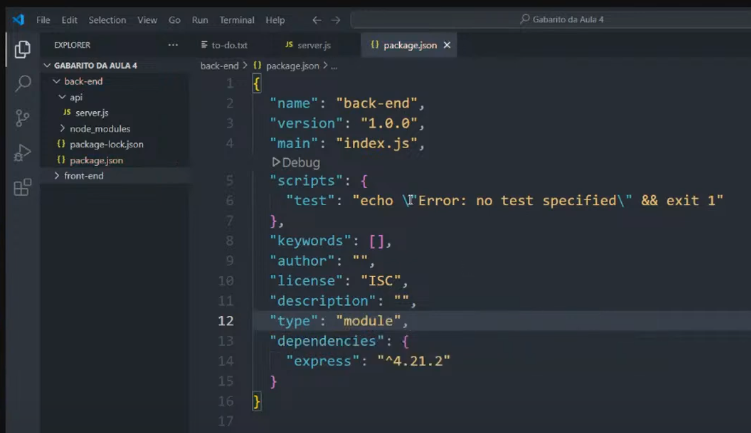
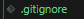
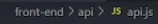
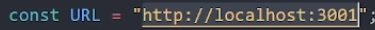
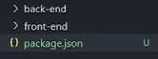
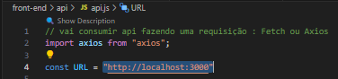
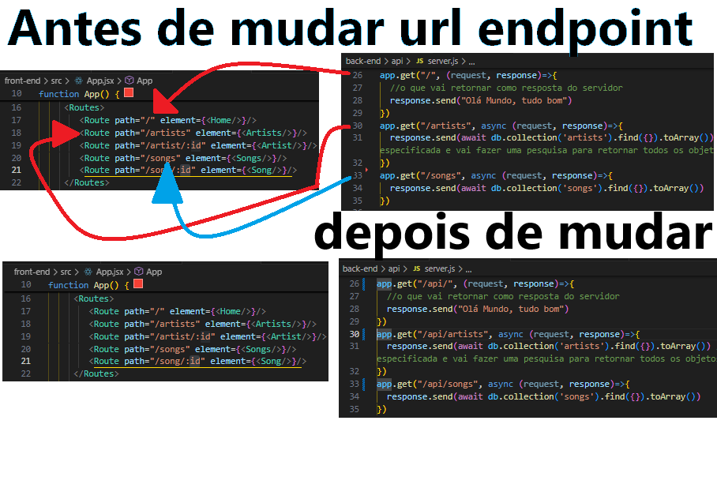
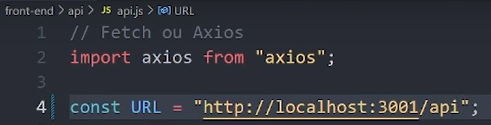
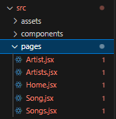

# Clone Spotify 
### Veja esse projeto clicando aqui [link](https://projeto-14-full-stack.onrender.com/)


###### imagens geradas no [shots.so](https://shots.so/)

### Deploy 
###### front-end e back-end dentro do mesmo repositório github hospedados no [render](https://render.com/)

### Technologias
###### `Front-end`
###### [react.js]()
###### [vite.js]()
###### lib p/ fazer requisiçãod do front [axios]()
###### lib p/ fazer midleware [cors]()
###### lib p/ gerenciar variaveis de ambiente para deploy [dotenv]() VAI TER QUE DESFAZER USO DESTA LIB

###### `Back-end`
###### ambiente de execução [node.js]()
###### framework para back-end [express.js]()
###### lib p/ driver conectar mongoDB com código back-end [mongodb](https://medium.com/@omalearumona/connecting-express-js-to-mongodb-a-step-by-step-guide-258172d2b27a)
###### pacote para gerenciar melhor o path de respostas do server.js estáticas `npm i path` [`path.resolve()`](https://www.geeksforgeeks.org/node-js-path-resolve-method/) [`path.join()`](https://nodejs.org/api/path.html#pathjoinpaths)
###### Banco de dados : [MongoDB]()

### Definir no `package.json` dentro da pasta `/back-end`
###### module ES jeito novo

###### commonjs jeito velho


### construção e execução do Back-end
###### express.js
###### entrar na pasta ```cd back-end```
###### inicializar pacote node ```npm init -y```
###### instalar express ```npm instal express``` ```npm i express```
#### dependendo da porta de conexão disponível ele executa, se a porta escolhida ta estiver oculpada, mude o numero da porta. Este codigo serve para executar o back-end
```
node ./api/server.js
``` 
###### atualizar o servidor enquando estou escrevendo no file dele. Depois de `control s`no file `server.js` fazer requesição na url (clica na url e clica enter) ```node --watch ./api/server.js``` 
###### banco de dados
###### fazer conta gratuita no mongoDB, criar o cluster , criar database, criar colections "tabelas do BD", permissão para qualquer domínio acessar o cluster, conectar aplicação com o cluster
###### installar o driver do BANCO DE DADOS na aplicação back-end ```npm install mongodb```
###### adicionar string de conexão no codigo backend no arquivo "back-end/api/connet.js". Substitua `<db_password>` pela sua senha de acesso ao banco ```mongodb+srv://thiagomasseno3:<db_password>@cluster0.2jukc.mongodb.net/?retryWrites=true&w=majority&appName=Cluster0```
###### adicione campos no collection do mongo DB e execute o arquivo `connect.js` para testar se conexão funciona  ```node ./api/connect.js```
###### criar um arquivo `./api/insertMany.js` e execute para inserir os dados no banco de dados não relacional ````node ./api/insertMany.js```

### construção e execução do Front-end
###### vite.js
###### instalar ferramenta de build ```npm create vite@latest .```
###### ```cd project_name_foulder```
###### instalar as dependency ```npm install```
###### executar o front-end ```npm run dev```

### Fazendo o Deploy
###### ARMAZENANDO ARQUIVOS front e back PARA O GITHUB DENTRO DO MESMO REPOSITÓRIO
###### Inicializa o repositorio local do git em um canto que pegue as duas pastas front e back ``` git init```
###### dentro das duas pastas `/front-end` e `/back-end` colocar um arquivo `.gitignore` com o nome dos arquivos que n serão enviados para o github

```
node_modules
.env
```
###### adicionar as duas pastas para o stage ```git add .```
###### confirmar alterações ```git commit -m "Finesh Version 1.0"```
###### agora o resto é linkar com o repositorio na nuvem
```
git remote add origin https://github.com/ThiagoMassenoMaciel/Projeto-13-full-Stack.git
git branch -M main
git push -u origin main
```
###### SE O DEPLOY FOSSE UM REPOSITÓRIO NO GIT PARA /BACK-END E OUTRO REPOSITORIO PARA /FRONT-END FAÇA ISSO
###### depois de hospedado o backend , pegar sua url desse servidor e colocar dentro da variavel `URL` na pasta do front-end


###### CONFIGURAÇÃO front e back PARA O GITHUB DENTRO DO MESMO REPOSITÓRIO
###### Quando os arquivos front/back estiverem carregados no servidor , ele vai procurar um arquivo `JSON` e executar os scripts `build` e `start`
###### Por este motivo além de existir um `JSON` dentro da pasta `/front-end` e outro `JSON` dentro da pasta `/back-end` é necessário outro arquivo `JSON` que vai servir globalmente para o servidor na pasta `./` atual
###### executar na pasta atual para criar este `JSON` padronizado globalmente
```
npm init -y
```
###### vai ficar assim 

###### CONFIGURANDO O SCRIPT "BUILD" DENTRO DO `package.json` GLOBAL
###### instalar as dependencias para dentro das pastas do ``/back-end`` e para o ``/front-end``
```
"npm install --prefix back-end && npm install --prefix front-end"
```
###### entrar dentro da pasta `/front-end` ir dentro do arquivo `package.json` e execute a build que tem dentro dos scripts
```
" npm run build --prefix front-end"
```
###### vai ficar assim dentro do `JSON`global
```
  "scripts": {
    "build": "npm install --prefix back-end && npm install --prefix front-end && npm run build --prefix front-end"
  },
```
###### CONFIGURANDO O SCRIPT "START" DENTRO DO `package.json` GLOBAL
###### vai executar o script "start" do `package.json` que esta dentro da pasta `/back-end` , ou seja apartir do `package.json` GLOBAL vou executar outro script de outro `package.json`
```
"npm run start --prefix back-end"
```
###### vai ficar assim dentro do `package.json`global
```
  "scripts": {
    "build": "npm install --prefix back-end && npm install --prefix front-end && npm run build --prefix front-end",
    "start": "npm run start --prefix back-end"
  },
```
###### CONFIGURAR O SCRIPT "START" DENTRO DO `package.json` DENTRO DA PASTA `/back-end`
###### colocar para executar o mesmo comando que usei para executar o back-end
```
"node ./api/server.js"
```
###### vai ficar assim dentro do  `package.json` dentro da pasta `/back-end`
```
  "scripts": {
    "start": "node ./api/server.js",
    "test": "echo \"Error: no test specified\" && exit 1"
  },
```

###### CONFIGURAR O FILE `vite.config.js` PARA NAVEGADOR NÃO TRAVAR O AWAIT
###### vai dentro deste arquivo e coloca isso depois da virgula
```
  build:{
    target: "esnext",
  },
```

###### VERIFICAR se a dependencia do banco de dados MONGOdb esta referenciado no `package.json` do back-end. Se nãoestiver , executar este comando apartir do caminho no terminal dentro da pasta Back-end
```
npm instal mongodb
```
###### TESTAR 
###### executar apartir da pasta raiz o script "build" do `package.json` GLOBAL
```
npm run build
```
###### executar apartir da pasta raiz o script "start" do `package.json` GLOBAL
```
npm run start
```
###### CRIAR VARIÁVEIS DO AMBIENTE 
###### mudar a URL que o front-end faz requisição de acordo com a variavel de ambiente : se é `development`, `production`, ...

###### deve diferenciar os endpoints no back-end das rotas no front-end

###### e não esquecer de ajeitar URL que o front-end faz requisição

###### dentro da pasta `/front-end` criar um arquivo com o nome `.env` e colocar esta variavel com este valor 
```
NODE_ENV = development
```
###### de acordo com o valor da variavel vai mudar valor da URL tal qual o front-end fará a requisição
|valor da variavel de ambiente | URL |
|-------|--------|
|development|"http://localhost:3000/api"|
|outro valor|"dominioDeploy/api"|
###### e para montar essa lógica preciso acesar o valor das variavel ambiente , farei isso usando dentro do `/front-end` a biblioteca `dotenv`
```
cd .\front-end\
npm i dotenv
```
###### e a lógica vai ficar dentro do arquivo `./front-end/api/api.js`, faça o import dotenv , acesse valor globalmente e monte a lógica do if para URL 
```
// vai consumir api fazendo uma requisição : Fetch ou Axios
import axios from "axios";
import "dotenv/config"

const {NODE_ENV} = process.env
const URL = NODE_ENV === 'development' ? "http://localhost:3000/api": "/api"

const responseArtists = await axios.get(`${URL}/artists`);
const responseSongs = await axios.get(`${URL}/songs`);

export const artistsArray = responseArtists.data;
export const songsArray = responseSongs.data;
//console.log(responseArtists.data);

```
###### CRIAR UMA RESPOSTA DO `./back-end/api/server.js` SERVER PARA REDIRECIONAR UM INDEX.HTML ESTÁTICO DA PASTA `./front-end/dist`
###### caso a requisição vier de um rota que não foi definida dentro do file `server.js` responder á esta rota com arquivo estático da pasta dist
###### dentro do arquivo `server.js` dizer ao express.js servir  de uma forma estática `app.use()`
###### midleware para servir arquivos estáticos `express.static(path-into-foulders)`
###### o asterisco `*` quer dizer todos os endpoint que não foram definidos anteriormente pelo arquivo `/back-end/api/server.js` 
###### `response.sendFile(foulder-path-file-static)` quer dizer enviar uma resposta estática no caminho path da pasta dist do front-end

```

app.use(express.static('../../front-end/dist')); // vai disponibilizar os arquivos do path 'dist' definido como resposta estática

//definir quais endpoints vão receber resposta estática : * todos aqueles que n foram definidos anteriormente
app.get("*", async (request, response)=>{ // se acessar qualquer outra url direciona para home
  response.sendFile('../../front-end/dist/index.html')
})


```

###### usar um pacote `npm i path` [`path.resolve()`](https://nodejs.org/api/path.html#pathresolvepaths) para gerenciar melhor o exato caminho de onde o comando está sendo executado(esse comando executa apartir do package.json do back-end)
###### executar isso no terminal
```
cd .\back-end\
npm i path
```
###### usando o pacote `path` dentro do arquivo `/back-end/api/server.js` vaificar assim

```
import path from "path";
const __dirname = path.resolve()

app.use(express.static(path.join(__dirname,'../front-end/dist')));// esse path pode ser acessado pela url

app.get("*", async (request, response)=>{ // se acessar qualquer outra url direciona para home
  response.sendFile(path.join(__dirname,'../front-end/dist/index.html'))
})
```
# parei no minuto 26:07 do video aula complementar da aula 4 do workshop fullStack spotify da hastag treinamentos dentro do meu ssd path (D:\meu arquivos aqui\workshops\hashtag treinamentos 2025 fullstack)


### Hooks do react aprendidos
###### `useLocation` - identificar qual url da pagina carregada
###### `useParams` - identificar qual o parâmetro no endpoint definido na rota atual
###### `useRef` - fazer referencia a uma tag/component/elemento específico
###### `useEffect` - adicionar efeitos colaterais, executar funções novamente depois de uma mudança da variavel de estado, executar funções depois que o componente foi desmontado/destruido

### Aprendi add rotas para outras páginas
###### instalar pacote
```
npm i react-router-dom
```
###### importar os componentes de rotas e acoplar dentro do file App.jsx todos outros componentes que criei
```
import { BrowserRouter, Routes, Route } from "react-router-dom";

function App() {
 
  return (
    <BrowserRouter>
     <Header/>
     <Main/>
    </BrowserRouter>
  )
}
```

###### Criar separado em uma pasta `pages` todas as novas paginas de acordo com as rotas escolhidas


###### Pense o que na tela vai ficar e o que vai ficar mudando quando alterar a rota, o header não muda , logo põe ele fora da tag de rotas, home-artists-songs muda , logo põe dentro da tag de rotas

``` 
<BrowserRouter>
  <Header/>

  <Routes>
    <Route path="/" element={<Home/>}/>
    <Route path="/artists" element={<Artists/>}/>
    <Route path="/artist/:id" element={<Artist/>}/>
    <Route path="/songs" element={<Songs/>}/>
    <Route path="/song/:id" element={<Song/>}/>
  </Routes>

</BrowserRouter>
```
###### agora todas as tags `<a></a>` vai ser substituida por ancora `<Link></Link>` do `react-router-dom`, e n esqueça de importar toda vez que usar, e outra coisa substitua o `href` do `<a></a>` para ser `to` do `<link></link>` 
```
//antes
<a href="/path"></a>

//agora
<Link to="/path"></Link>
```
