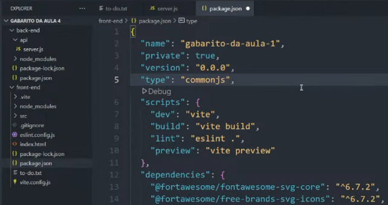

### Technologias
###### `Front-end`
###### [react.js]()
###### [vite.js]()
###### lib p/ fazer requisiçãod do front [axios]()
###### lib p/ fazer midleware [cors]()

###### `Back-end`
###### [node.js]()
###### [express.js]()
###### Banco de dados : [MongoDB]()

### import de bibliotecas e arquivos
###### module ES jeito novo

###### commonjs jeito velho


### construção e execução do Back-end
###### express.js
###### entrar na pasta ```cd back-end```
###### inicializar pacote node ```npm init -y```
###### instalar express ```npm instal express``` ````npm i express```
###### dependendo da porta de conexão disponível ele executa, se a porta escolhida ta estiver oculpada, mude o numero da porta. Este codigo serve para executar o back-end ```node ./api/server.js``` 
###### atualizar o servidor enquando estou escrevendo no file dele. Depois de `control s`no file `server.js` fazer requesição na url (clica na url e clica enter) ```node --watch ./api/server.js``` 
###### banco de dados
###### fazer conta gratuita no mongoDB, criar o cluster , criar database, criar colections "tabelas do BD", permissão para qualquer domínio acessar o cluster, conectar aplicação com o cluster
###### installar o driver na aplicação back-end ```npm install mongodb```
###### adicionar string de conexão no codigo backend no arquivo "back-end/api/connet.js". Substitua `<db_password>` pela sua senha de acesso ao banco ```mongodb+srv://thiagomasseno3:<db_password>@cluster0.2jukc.mongodb.net/?retryWrites=true&w=majority&appName=Cluster0```
###### adicione campos no collection do mongo DB e execute o arquivo `connect.js` para testar se conexão funciona  ```node ./api/connect.js```
###### criar um arquivo `./api/insertMany.js` e execute para inserir os dados no banco de dados não relacional

### construção e execução do Front-end
###### vite.js
###### instalar ferramenta de build ```npm create vite@latest .```
###### ```cd project_name_foulder```
###### instalar as dependency ```npm install```
###### executar o front-end ```npm run dev```

### Fazendo o Deploy
###### ARMAZENANDO ARQUIVOS front e back PARA O GITHUB DENTRO DO MESMO REPOSITÓRIO
###### Inicializa o repositorio local do git em um canto que pegue as duas pastas front e back ``` git init```
###### dentro das duas pastas `/front-end` e `/back-end` colocar um arquivo `.gitignore` com o nome dos arquivos que n serão enviados para o github

```
node_modules
.env
```


### Hooks do react aprendidos
###### `useLocation` - identificar qual url da pagina carregada
###### `useParams` - identificar qual o parâmetro no endpoint definido na rota atual
###### `useRef` - fazer referencia a uma tag/component/elemento específico

### Aprendi add rotas para outras páginas
###### instalar pacote
```
npm i react-router-dom
```
###### importar os componentes de rotas e acoplar dentro do file App.jsx todos outros componentes que criei
```
import { BrowserRouter, Routes, Route } from "react-router-dom";

function App() {
 
  return (
    <BrowserRouter>
     <Header/>
     <Main/>
    </BrowserRouter>
  )
}
```

###### Criar separado em uma pasta `pages` todas as novas paginas de acordo com as rotas escolhidas


###### Pense o que na tela vai ficar e o que vai ficar mudando quando alterar a rota, o header não muda , logo põe ele fora da tag de rotas, home-artists-songs muda , logo põe dentro da tag de rotas

``` 
<BrowserRouter>
  <Header/>

  <Routes>
    <Route path="/" element={<Home/>}/>
    <Route path="/artists" element={<Artists/>}/>
    <Route path="/artist/:id" element={<Artist/>}/>
    <Route path="/songs" element={<Songs/>}/>
    <Route path="/song/:id" element={<Song/>}/>
  </Routes>

</BrowserRouter>
```
###### agora todas as tags `<a></a>` vai ser substituida por ancora `<Link></Link>` do `react-router-dom`, e n esqueça de importar toda vez que usar, e outra coisa substitua o `href` do `<a></a>` para ser `to` do `<link></link>` 
```
//antes
<a href="/path"></a>

//agora
<Link to="/path"></Link>
```